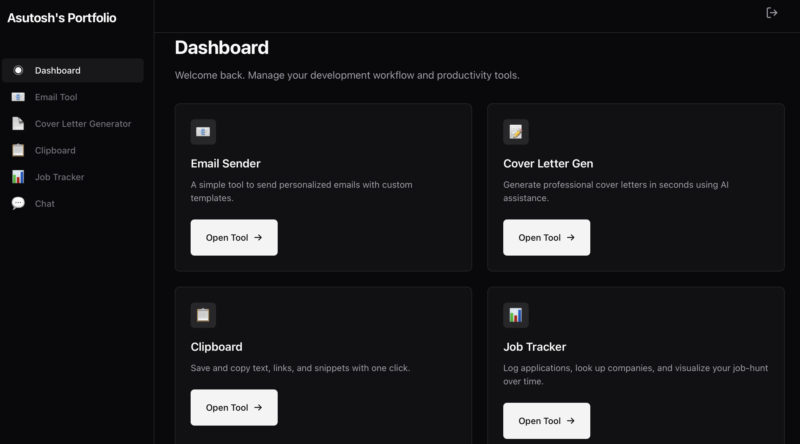

# Asutosh's Dashboard

A self-hosted web dashboard for sending job application emails, generating cover letters, tracking applications, and managing a clipboard — cross-compiled for **Raspberry Pi (DietPi)** and deployed via **GitHub Actions CI/CD**.



## Features

- **Email Sender** — dual Gmail support (University via OAuth API, Personal via SMTP)
- **Cover Letter Generator** — LaTeX-generated PDFs via Tectonic
- **Job Tracker** — CRUD + stats + timeline + natural-language SQL query against Supabase
- **Clipboard** — save and copy text snippets
- **LLM Chat** — persistent chat sessions with OpenRouter models
- **Passkey auth** session-based login

## CI/CD

Every push to `main` triggers a GitHub Actions workflow that:

1. Cross-compiles the Go binary for `linux/arm64`
2. Injects `.env`, `credentials.json`, `token.json` from repository secrets
3. Bundles everything into `myapp-linux-arm64.tar.gz`
4. Creates a GitHub Release with the tarball attached

## Deploy on Raspberry Pi

```bash
# One-time setup
echo 'ghp_xxx' > ~/.github_token && chmod 600 ~/.github_token

# Pull the latest release
./deploy.sh /opt/pi_portfolio

# Run
/opt/pi_portfolio/pi_portfolio_arm64
```

## Local Build

```bash
GOOS=linux GOARCH=arm64 CGO_ENABLED=0 go build \
  -ldflags="-s -w -X main.buildTime=$(date -u +%Y-%m-%dT%H:%M:%SZ) -X main.commitHash=$(git rev-parse --short HEAD)" \
  -o pi_bundle/pi_portfolio_arm64
```

## Project Structure

```
├── main.go                 # HTTP server, routes, auth
├── email.go                # Email sending (SMTP + Gmail API)
├── coverletter.go          # Cover letter PDF generation
├── tracker.go              # Job tracker handlers
├── tracker_query.go        # NL-to-SQL query endpoint
├── clipboard.go            # Clipboard tool
├── llm_chat.go             # OpenRouter chat with sessions
├── oauth.go                # Gmail OAuth token management
├── auth_limit.go           # Login rate limiter
├── db_backup.go            # Automated database backups
├── http_meta.go            # Security headers + request IDs
├── runtime_templates.go    # Embed + disk fallback templates
├── templates/              # HTML templates + email/LaTeX templates
├── static/                 # Embedded CSS/JS
├── sql/                    # Optional DB scripts
├── deploy.sh               # Pull-based updater for the Pi
├── .github/workflows/      # GitHub Actions CI/CD
└── pi_bundle/              # Local deployment folder
```

## Configuration

Create a `.env` file with your secrets. Required variables:

| Variable | Description |
|----------|-------------|
| `EMAIL` / `PASSWORD` | Gmail credentials |
| `ACCESS_PASSKEY` | Web login passkey |
| `DATABASE_URL` | Postgres connection URI |
| `OPENROUTER_API_KEY` | For NL-to-SQL & chat features |

For the CI/CD pipeline, store these in **GitHub Secrets** (`Settings → Secrets and variables → Actions`):

| Secret | Content |
|--------|---------|
| `PROD_ENV_FILE` | Full `.env` file contents |
| `GOOGLE_CREDENTIALS` | `credentials.json` (one line) |
| `GMAIL_TOKEN_JSON` | `token.json` (one line) |

## Tech Stack

- **Go** — single-binary HTTP server
- **Supabase** — Postgres database
- **Tectonic** — LaTeX PDF generation
- **OpenRouter** — LLM API gateway
- **ngrok** — public tunnel (optional)
- **GitHub Actions** — cross-compile & release pipeline